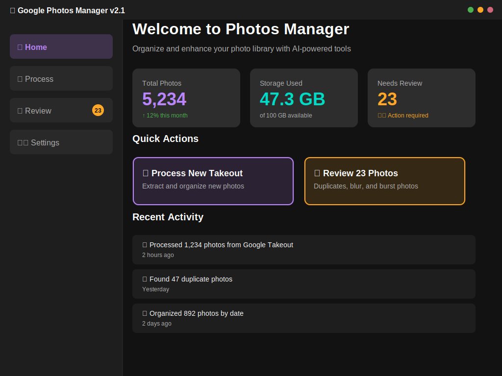

# Google Photos Manager

<div align="center">


**Intelligent Photo Organization & Duplicate Management for Google Takeout**

[](https://github.com/NickNak86/Mikes_GooglePhoto-Fixer/releases)
[](https://www.python.org)
[](LICENSE)
[](https://github.com/NickNak86/Mikes_GooglePhoto-Fixer/actions)
[](https://nicknakr86.github.io/Mikes_GooglePhoto-Fixer)
[](CONTRIBUTING.md)

[Features](#-features) •
[Quick Start](#-quick-start) •
[Documentation](https://nicknakr86.github.io/Mikes_GooglePhoto-Fixer) •
[Roadmap](ROADMAP.md) •
[Contributing](CONTRIBUTING.md)

</div>

---

## ✨ Features

### 🎯 Core Capabilities

- **🔍 Duplicate Detection** - SHA256 hash-based duplicate identification with quality ranking
- **👁️ Blur Detection** - OpenCV-powered blur detection using Laplacian variance
- **📸 Burst Photo Management** - Automatic grouping and quality assessment of burst sequences
- **📏 Size Filtering** - Flag photos below configurable quality thresholds
- **⚡ Parallel Processing** - Multi-threaded processing for maximum performance
- **📊 Quality Assessment** - Multi-factor scoring (size, resolution, sharpness, metadata)

### 💻 Desktop Application

- Material Design Dark Mode interface
- Real-time progress tracking with ETA
- DupeGuru-style review interface
- **Comprehensive logging and error handling** - Detailed error messages, stack traces, and recovery suggestions
- Activity Log with real-time updates and error reporting
- Cross-platform (Windows, macOS, Linux)

### 📱 Mobile Application

- Native Android app with Material Design
- Touch-optimized interface
- Background processing support
- Storage permission management
- Mobile-optimized performance

---

## 🖼️ Screenshots

<table>
<tr>
<td width="50%">

### Desktop



*Material Design Dark Mode with real-time progress tracking*

</td>
<td width="50%">

### Mobile


*Touch-optimized Android interface*

</td>
</tr>
</table>

---

## 🚀 Quick Start

### Installation Scripts

=== "**Linux/macOS**"

```bash
git clone https://github.com/NickNak86/Mikes_GooglePhoto-Fixer.git
cd Mikes_GooglePhoto-Fixer
chmod +x install.sh
./install.sh
```

=== "**Windows**"

```powershell
git clone https://github.com/NickNak86/Mikes_GooglePhoto-Fixer.git
cd Mikes_GooglePhoto-Fixer
powershell -ExecutionPolicy Bypass -File install.ps1
```

### Manual Installation

```bash
# Create virtual environment
python -m venv venv
source venv/bin/activate  # Windows: venv\Scripts\activate

# Install dependencies
pip install -r requirements.txt

# Run desktop app
python PhotoManager.py
```

### Building Android APK

```bash
# Install mobile dependencies
pip install kivy kivymd buildozer cython

# Build debug APK
buildozer -v android debug

# Install on device
buildozer android deploy run
```

📖 **Full documentation**: [Installation Guide](https://nicknakr86.github.io/Mikes_GooglePhoto-Fixer/getting-started/installation/)

---

## 📋 Requirements

| Platform | Version | RAM | Storage |
|----------|---------|-----|---------|
| **Desktop** | Python 3.9+ | 4GB+ | 10GB+ |
| **Android** | API 21+ (Android 5.0+) | 2GB+ | 5GB+ |

### Python Dependencies

```
Pillow>=10.0.0           # Image processing
opencv-python>=4.8.0     # Blur detection
numpy>=1.24.0            # Array operations
python-dateutil>=2.8.2   # Date handling
kivy>=2.2.1             # Mobile UI (optional)
kivymd>=1.1.1           # Material Design (optional)
```

---

## 📖 Documentation

Comprehensive documentation available at **[docs.site](https://nicknakr86.github.io/Mikes_GooglePhoto-Fixer)**

### Quick Links

- 📚 [**User Guide**](https://nicknakr86.github.io/Mikes_GooglePhoto-Fixer/user-guide/desktop-app/) - Desktop & mobile usage
- 🏗️ [**API Reference**](https://nicknakr86.github.io/Mikes_GooglePhoto-Fixer/api/photo-processor/) - Developer documentation
- 📱 [**Mobile Development**](MOBILE_BUILD.md) - Building the Android app
- 🎓 [**Tutorials**](https://nicknakr86.github.io/Mikes_GooglePhoto-Fixer/tutorials/first-time-setup/) - Step-by-step guides
- ❓ [**FAQ**](https://nicknakr86.github.io/Mikes_GooglePhoto-Fixer/faq/) - Common questions

---

## 🎯 Use Cases

Perfect for:

- 📦 Processing Google Takeout exports (ideal for bi-annual workflow)
- 🗂️ Organizing thousands of photos efficiently
- 🔍 Finding and removing duplicate photos
- 👁️ Identifying blurry or low-quality shots
- 📱 Managing photos on both desktop and mobile
- 👨‍👩‍👧‍👦 Family photo library management

---

## 🏗️ Architecture

```
┌─────────────────────────────────────────┐
│        User Interface Layer             │
│  ┌──────────────┐  ┌──────────────┐   │
│  │  tkinter UI  │  │  Kivy UI     │   │
│  │  (Desktop)   │  │  (Mobile)    │   │
│  └──────────────┘  └──────────────┘   │
├─────────────────────────────────────────┤
│      Platform Abstraction Layer         │
│         (mobile_utils.py)               │
├─────────────────────────────────────────┤
│       Business Logic Layer              │
│    (PhotoProcessorEnhanced.py)          │
│  • Parallel hash calculation            │
│  • OpenCV blur detection                │
│  • Duplicate grouping                   │
│  • Quality assessment                   │
│  • File organization                    │
└─────────────────────────────────────────┘
```

**Design Principles:**
- 🔄 Shared backend for all platforms
- 🎨 Platform-specific UIs
- ⚡ Multi-threaded for performance
- 🛡️ Non-destructive processing

---

## 📊 Performance

### Desktop (Mid-range: i5-8400, 16GB RAM, SSD)

| Photos | Time | Throughput |
|--------|------|------------|
| 1,000 | 2-3 min | ~350 photos/min |
| 10,000 | 15-20 min | ~500 photos/min |
| 50,000 | 60-90 min | ~550 photos/min |

### Mobile (Snapdragon 700 series, 6GB RAM)

| Photos | Time | Throughput |
|--------|------|------------|
| 1,000 | 3-5 min | ~250 photos/min |
| 10,000 | 20-30 min | ~400 photos/min |
| 50,000 | 90-120 min | ~450 photos/min |

*Includes hash calculation, blur detection, duplicate grouping, and file organization*

---

## 🗺️ Roadmap

View our full [**Project Roadmap**](ROADMAP.md) for upcoming features and releases.

### Coming Soon (v2.2)

- iOS support with same architecture
- Enhanced UI with PyQt6/PySide6
- Improved gesture controls
- Settings screen implementation

### Planned (v3.0+)

- Cloud sync & Google Drive integration
- AI-powered quality assessment
- Face detection and grouping
- Progressive Web App (PWA)

[**Vote on features →**](https://github.com/NickNak86/Mikes_GooglePhoto-Fixer/discussions)

---

## 🤝 Contributing

We welcome contributions! Please see our [**Contributing Guide**](CONTRIBUTING.md) for details.

### Quick Contribution Steps

```bash
# 1. Fork & clone
git clone https://github.com/YOUR_USERNAME/Mikes_GooglePhoto-Fixer.git

# 2. Create feature branch
git checkout -b feature/AmazingFeature

# 3. Make changes & test
pytest tests/

# 4. Commit & push
git commit -m "Add AmazingFeature"
git push origin feature/AmazingFeature

# 5. Open Pull Request
```

### Ways to Contribute

- 🐛 [Report bugs](https://github.com/NickNak86/Mikes_GooglePhoto-Fixer/issues/new?template=bug_report.md)
- 💡 [Suggest features](https://github.com/NickNak86/Mikes_GooglePhoto-Fixer/issues/new?template=feature_request.md)
- 📝 Improve documentation
- 🧪 Write tests
- 💻 Submit pull requests
- ⭐ Star the repository

---

## 📁 Project Structure

```
Mikes_GooglePhoto-Fixer/
├── 🖥️  Desktop & Mobile Apps
│   ├── PhotoManager.py              # Desktop application (tkinter)
│   ├── PhotoManagerMobile.py        # Mobile application (Kivy)
│   └── ReviewInterface.py           # Desktop review interface
│
├── ⚙️  Core Processing
│   ├── PhotoProcessorEnhanced.py    # Main processing engine
│   └── mobile_utils.py              # Platform abstraction layer
│
├── 📱 Mobile Build
│   ├── buildozer.spec              # Android build configuration
│   ├── MOBILE_BUILD.md             # Build instructions
│   └── MOBILE_ARCHITECTURE.md      # Architecture documentation
│
├── 🧪 Testing & Quality
│   ├── tests/                      # Test suite
│   ├── pytest.ini                  # Pytest configuration
│   ├── .pre-commit-config.yaml     # Pre-commit hooks
│   └── pyproject.toml              # Tool configurations
│
├── 📚 Documentation
│   ├── docs/                       # MkDocs documentation
│   ├── mkdocs.yml                  # Documentation config
│   ├── CONTRIBUTING.md             # Contribution guide
│   ├── CODE_OF_CONDUCT.md          # Code of conduct
│   ├── SECURITY.md                 # Security policy
│   ├── CHANGELOG.md                # Version history
│   └── ROADMAP.md                  # Project roadmap
│
├── 🔧 Development
│   ├── .github/                    # GitHub workflows & templates
│   ├── .vscode/                    # VS Code settings
│   ├── docker-compose.yml          # Development containers
│   ├── install.sh                  # Linux/Mac installer
│   └── install.ps1                 # Windows installer
│
└── 🎨 Assets
    ├── icon.svg                    # App icon
    ├── banner.svg                  # README banner
    ├── screenshot-desktop.svg      # Desktop screenshot
    ├── screenshot-mobile.svg       # Mobile screenshot
    ├── social-card-og.svg          # Open Graph card
    └── social-card-twitter.svg     # Twitter card
```

---

## 🛠️ Development

### Setup Development Environment

```bash
# Using installation script (recommended)
./install.sh  # or install.ps1 on Windows

# Or using Docker
docker-compose up desktop-dev

# Or manually
python -m venv venv
source venv/bin/activate
pip install -e ".[dev]"
pre-commit install
```

### Running Tests

#### Automated Test Suite

```bash
# Generate test data (first time only)
python generate_test_data.py ./test-data

# Run comprehensive test suite
python run_all_tests.py --test-data ./test-data --base-path ./test-output --clean

# Check test report
cat TEST-REPORT.md
```

#### Unit Tests

```bash
# Run all tests
pytest

# Run with coverage
pytest --cov=. --cov-report=html

# Run specific test file
pytest tests/unit/test_mobile_utils.py
```

#### Manual Testing

```bash
# Start web interface
python PhotoManagerWeb.py
# Access: http://localhost:5000
# Logs: photo_manager_web.log

# Test with generated data
# 1. Set base path in settings
# 2. Copy test-data/* to base_path/GoogleTakeout/
# 3. Click "Organize My Photos"
# 4. Check Activity Log for detailed progress
```

📖 **Full testing guide**: See [TESTING-GUIDE.md](TESTING-GUIDE.md) for comprehensive testing documentation

### Code Quality

```bash
# Format code
black .
isort .

# Lint
flake8 .
mypy .

# Security check
bandit -r .

# Run all pre-commit hooks
pre-commit run --all-files
```

---

## 📄 License

This project is licensed under the **MIT License** - see the [LICENSE](LICENSE) file for details.

**You are free to:**
- ✅ Use commercially
- ✅ Modify
- ✅ Distribute
- ✅ Use privately

---

## 🙏 Acknowledgments

- [**Kivy**](https://kivy.org/) - Cross-platform Python framework
- [**KivyMD**](https://kivymd.readthedocs.io/) - Material Design components
- [**OpenCV**](https://opencv.org/) - Computer vision library
- [**Pillow**](https://python-pillow.org/) - Python Imaging Library
- [**DupeGuru**](https://dupeguru.voltaicideas.net/) - Inspiration for review interface

---

## 📞 Support & Community

<div align="center">

[](https://github.com/NickNak86/Mikes_GooglePhoto-Fixer/issues)
[](https://github.com/NickNak86/Mikes_GooglePhoto-Fixer/discussions)
[](https://github.com/NickNak86/Mikes_GooglePhoto-Fixer/stargazers)

**Get Help:**
[📖 Documentation](https://nicknakr86.github.io/Mikes_GooglePhoto-Fixer) •
[💬 Discussions](https://github.com/NickNak86/Mikes_GooglePhoto-Fixer/discussions) •
[🐛 Report Issues](https://github.com/NickNak86/Mikes_GooglePhoto-Fixer/issues)

</div>

---

## ⭐ Star History

<div align="center">

[](https://star-history.com/#NickNak86/Mikes_GooglePhoto-Fixer&Date)

**If you find this project helpful, please consider giving it a star! ⭐**

</div>

---

<div align="center">

**Built with ❤️ for easy photo management**

*Version 2.1.0 - Desktop & Mobile Edition*

[⬆ Back to Top](#google-photos-manager)

</div>
